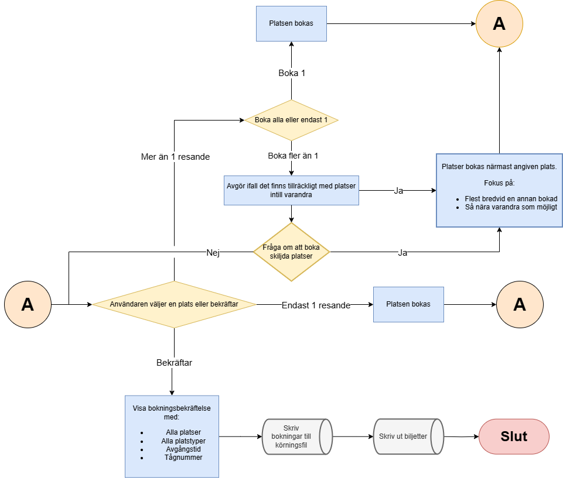

# Projektuppgift DD1310 HT24 - Marcell Ziegler
Jag har valt uppgiften [127 Platsbokning på SJ](https://people.kth.se/~dbosk/prgx24.d/platsbokning.pdf)


# Projektspecifikation
## Algoritm



### Beskrivning
1. Programmet startas och ev. lagrade bokningar på tåg laddas in.
    - Om det finns lagrade bokningar, verifiera att dessa är aktuella och radera ev. gamla bokningar.
    - Om inget finns lagrat laddas någon default-uppsättning på tåg som användaren ombeds spara.
2. Användaren får välja om de vill:
    - (a) Boka biljett(er)
    - (b) Avboka biljett
    - (c) Visa bokningar
    - (d) Avsluta
3. Korresponderande flöde påbörjas. Se nedan.
4. När flödet avslutas får användaren alternativen i 2. igen.
5. När avsluta välja i 2. kommer alla lagrade bokningar att skrivas till en körningsfil för användning nästa gång och bokade biljetter skrivs ut till plats önskad av användaren i pop-up.

#### Flöde (a): Bokning
1. Rätt avgång väljs.
2. Användaren för välja ifall de vill boka 1 eller flera platser alternativt bekräfta bokningen och avsluta.
3. Ifall 1 plats väljs, bokas angiven passagerare på platsen ifall den är tom, annars visasa felmedellande.
4. Ifall fler platser väljs, försöker systemet boka alla platser intill varandra. Ifall detta inte går frågas användaren ifall skiljda platser önskas. Om ja: boka resande. Om nej: gå vidare.
5. Flödet upprepas från 1. tills användaren väljer att avsluta.

#### Flöde (b): Avbokning
1. Användaren anger platsnr. eller passagerarnamn till önskad avbokning.
2. Passageraren avbokas ifall denne finns, annars visas felmedellande.
3. Tillbaka till Huvudmeny.

#### Flöde (c): Skriv biljetter
1. Befintliga biljetter i denna app-instans skrivs ut.
2. Tillbaka till huvudmenyn.

# Funktioner
> Notera: Jag har valt att wrap:a hela appen i klassen [App](README.md#app) och generellt arbetat väldigt objekt-orienterat. Därför ligger det mesta av logiken i klasserna.
- `load_trains_from_file(path: str) -> list[Train]` - Laddar in tåg från angivna filen och returnerar de som en lista. Använder `pickle` för att undvika komplex textbaserad serialisering.
- `save_trains_to_file(trains: Iterable[Train], path: str) -> None` - Skriver ut alla tåg binärt via `pickle` till den angivna filen.
- `add_train_to_file(train: Train) -> None` - Lägger till den angivna tåget i den angivna filen. Detta är en hjälpfunktion för att fylla tågfilen när jag först skapar den.

# Klasser

## Seat
Innehåller information om en stol, dess position och om den är upptagen. Är praktiskt taget endast en struct med lite hjälpmetoder

### Attribut
- `number: int` - stolsnummer i vagnen
- `passenger_name: str` - passagerare som sitter i stolen

### Metoder
- `is_booked() -> bool` - Ange om stolen är bokad


## Carriage
Lagrar en vagn, dess stolar och alla passagerare.

### Attribut
- `seats: list[tuple[list[Seat], list[Seat]]]` - lista med alla par av stolsrader separerade av en gång. Varje element innehåller en tuple av två listor med stolar, en för varje sida av gången.
- `seating_configuration: str` - sittkonfiguration (ex. "2+2", "3+2" etc.)
- `number: int` - vagnnummer

### Metoder
- `get_seat_num(number: int) -> Seat` - returnerar en specifik stol baserat på nummer. Ger `IndexError` om angivet stolsnummer inte finns i vagnen.

    För ett stolsnummer $n$, i en vagn med $n_l$ stolar till vänster om gånger och $n_r$ stolar till höger, låt
    $$\left\{\begin{array}{l}b_r = n_l + n_r \\ r = \left\lceil n / b_r \right\rceil \\ i = n - b_r \cdot (r - 1) \end{array}\right.$$
    där $r$ är stolens radnummer och $i$ är stolens index i raden. Detta innebär att man kommer åt stol nr $n$ med uttrycket `Carriage.seats[r - 1][0][i - 1]` om den befinner sig på vänster sida om gånger, dvs $i \leq n_l$ annars med uttrycker `Carriage.seats[r - 1][1][i - 1 - n_l]`.
- `get_seat_name(passenger_name: str) -> Seat` - Returnerar den stol med den angivna passageraren. Ger `ValueError` om fler än en stol med samma namn finns. Ger `KeyError` om passageraren inte kan hittas.
- `book_passenger(name: str, seat_num: int) -> None` - Bokar in passageraren i en specifik stol. Ger `IndexError` ifall ogiltigt stolsnummer anges. Ger `ValueError` ifall stolen redan är bokad.
- `unbook_seat(number: int) -> None` - Tar bort passagerare från den angivna stolen. `IndexError` ifall stolen inte finns.
- `unbook_passenger(passenger_name: str) -> None` - Tar bort angiven passagerare från angiven stol. `KeyError` om ingen sådan passagerare finns.

## Train
Lagrar ett tåg, dess avgångstid, ankomsttid, startstation, destination och en lista med vagnar.

### Attribut
- `train_number: int` - unikt tågnummer
- `start: str` - startstation
- `destination: str` - destination
- `departure_time: datetime` - avgångstid
- `arrival_time: datetime` - ankomsttid
- `carriages: list[Carriage]` - lista med vagnar

### Metoder
- `book_passenger(passenger_name: str, carriage_number: int, seat_number: int) -> None` - Bokar in en passagerare på angiven plats. Ger `IndexError` om platsen inte finns och `ValueError` ifall stolen redan är bokad.
- `unbook_seat(carriage_number: int, seat_number: int) -> None` - Tar bort passagerare från den angivna stolen. `IndexError` ifall stolen inte finns.
- `unbook_passenger(passenger_name: str) -> None` - Tar bort angiven passagerare från angiven stol. `KeyError` om ingen sådan passagerare finns.
- `__lt__(self, other: Train) -> bool` - Jämförelse för sortering. Utgår från `departure_time`

## App
Ärver `tkinter.Tk`. Innehåller all kod för att generera GUI:n samt all state för den nuvarande körningen. Den innehåller även kod för att interagera med användaren. Många widgets kommer från separata klasser, se rubriken nedan.

### Attribut
- `_trains: list[Train]` - Intern lista av alla tåg. Sorteras utefter avgångstid enligt (se [Train.\_\_lt\_\_()](README.md#metoder-2)). Används för att lagra alla giltiga avgångar.

### Metoder


## Widgets
En mängd olika små klasser för att göra GUI:n mer modulär. Ett exempel på mitt allra vanligaste som säkert kommer vara med när skriver GUI:n:
```python
class LabeledEntry(ttk.Frame):
    """An entry with a corresponding label which shows what should be entered
    """

    def __init__(self, master, label_text: str, entry_var: tk.StringVar *args, **kwargs):
        super().__init__(master, *args, **kwargs)

        self.columnconfigure(0, weight=1)
        self.rowconfigure(0, weight=1)
        self.rowconfigure(1, weight=1)

        self.label = ttk.Label(self, text=label_text)
        self.label.grid(column=0, row=0, sticky="w")

        self.entry = ttk.Entry(self, textvariable=entry_var)
        self.entry.grid(column=0, row=1, sticky="nesw", padding=5)

```

Detta är dår för att jag ska kunna skriva som nedan och inte behöva upprepa bägge widgets varje gång.
```python
class App(tk.Tk)
    ...
    def __init__(...):
        self.some_input = LabeledEntry(self.some_frame, "foo", bar)
        self.some_input.grid(column=0, row=0, sticky="nesw")
```